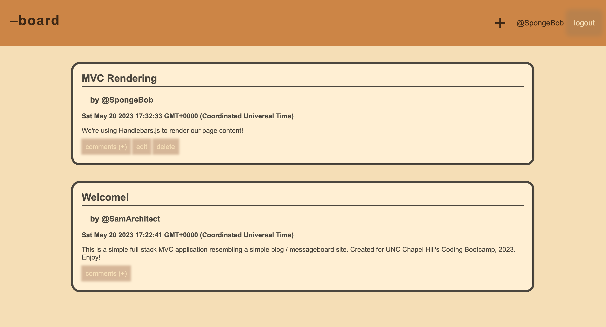

# (-)Board Tech Blog

# Description
This is a full-stack MVC application presenting a simple, functional internet blog / messageboard, using a MySQL database, Express.js, and Handlebars.js.

## Table of Contents
1. [Installation](#installation)
2. [Usage](#usage)
3. [License](#license)
4. [Contributors](#contributors)
5. [Questions](#questions)
# Installation
Simply view the deployed site [here](https://fierce-refuge-87554.herokuapp.com/). To run locally in developer mode, download the project folder, install node dependencies with 'npm install', seed the database if you choose to with 'npm run seed', then start the application with 'npm start'. Then, navigate to localhost:3001 in your browser to view the application.
# Usage
If you are not logged in, you will always be redirected to the login/signup page. Here you can create an account. Upon creating an account you will be redirected to the homepage where you can read, create, update, and delete posts, and leave comments on your or other users' posts. While logged in, clicking the page header on the left of the nav bar will always return you to this page. You are blocked from editing or deleting other users' posts, but you will see the appropriately labeled buttons for these actions on posts of your own creation. To create a new post, click the + sign in the nav bar.
# License
The MIT License
# Contributors
N/A
# Questions
GitHub username: altavada -- Email address: sam.tomaka@gmail.com